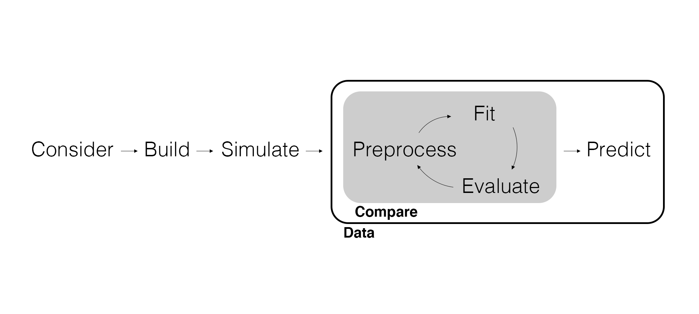

## Course Working Directory

Create a local course folder on your computer (outside any file sync service) that includes folders for your:

- Slides
- Notes
- Data
- Exercises
- Projects

## RStudio Tools > Global Options

- General > Save workspace to .RData on exit: Never.
- Code > Editing > Execution > Ctrl + Enter executes: Multiple consecutive R lines.
- Code > Editing > Use native pipe operator.
- Code > Display > General > Highlight selected line.
- Code > Display > General > Rainbow parentheses.
- Code > Saving > Automatically save when editor loses focus.
- Appearance.

## Marketing Analytics Process

<center>
{width="900px"}
</center>

---

{width=500px}

## Inference

Remember that models *extract information* from the data to inform our managerial decision. While data wrangling and visualization can *suggest* patterns of interest, a model is often needed.

How we model the data depends on if we care about **inference** or only about *prediction*.

- Inference means "reaching a conclusion based on evidence."
- Inferential modeling may also be referred to as **statistical modeling** given its ties to statistics.
- We use inferential models to understand a process we don't observe.

Note that models used for inference can also be used to predict, but they are focused primarily on understanding unobserved processes.

## Inferential Modeling Workflow

<center>
{width=900px}
</center>

## Consider | Consider the Data Generating Process

Inference is often needed for managerial decisions in marketing because inference is required when we would like to **intervene** in the process we don't observe.

For example, consider the managerial decision of allocating promotional spending.

- What data would we use to inform this decision?
- What is a possible process we don't observe that resulted in this data?

Your story about the possible **data generating process** is the beginning of a model.

---

It's helpful to draw the possible data generating process as a **graph**. This is a special kind of graph known as a **directed acyclic graph** or **DAG**.

```{r echo=FALSE, message=FALSE, warning=FALSE}
# Create a DAG.
library(dagitty)
library(ggdag)

dag <- dagitty("dag {
  F -> P
  F -> S
  P -> S
}")

ggdag(dag, layout = "circle") +
  theme_dag()
```

## Build | Build a Statistical Model

If a model starts with a story about the *data generating process*, we need to translate it into a mathematical equation. For example:

$$\text{sales} = 10 + 3 \times \text{promotion_spend}$$

Think of this equation as a *function*.

- What is the input?
- What is the output?
- What is the story?

---

We observe `sales` and `promotion_spend` in the data, but we don't observe the effect of `promotion_spend` on `sales`. 

The unobserved variables in a model are called **parameters** and are typically expressed using Greek letters:

$$\text{sales} = \beta_0 + \beta_1 \times \text{promotion_spend}$$

Here $\beta_0$ is the amount of `sales` when there is zero `promotion_spend` and $\beta_1$ is the effect of `promotion_spend` on `sales`.

Are we missing anything to this story?

---

To make this a *statistical* model we need to express that our model is not going to explain everything about the data generating process:

$$\text{sales} = \beta_0 + \beta_1 \times \text{promotion_spend} + \epsilon$$

Here $\epsilon$ represents **statistical error**. Think of this $\epsilon$ as including every variable beyond `promotion_spend` that effects `sales`.

---

Every inferential model is a *simplification* of the *true* data generating process (which we don't observe). Even so, models can still help us learn about parameters, assuming the model is a good approximation of the true data generating process.

<center>
{width=700px}
</center>

## Preprocess | Preprocess Data for Modeling

When working with real data, we often need to *preprocess the data* in order to model it or to make it easier for the model to use. Think of this as **data wrangling for models**.

One common preprocessing problem is dealing with discrete data.

```{r echo=FALSE, message=FALSE}
# Demonstrate dummy coding.
library(tidyverse)

sub_category <- read_csv(here::here("Data", "soup_data.csv")) |> 
  transmute(sub_category = Sub_Category)

one_dummy <- sub_category |> 
  filter(sub_category %in% c("CONDENSED SOUP", "RAMEN"))

one_dummy |> unique()
```

---

For the computer to understand the different *levels* of a discrete variable used in a model, we need to recode into *binary variables*.

```{r echo=FALSE, message=FALSE}
# One dummy.
one_dummy |> 
  mutate(fastDummies::dummy_cols(sub_category)) |> 
  rename(
    condensed_soup = '.data_CONDENSED SOUP',
    ramen = '.data_RAMEN'
  ) |> 
  select(sub_category, condensed_soup, ramen)
```

---

The more levels in a discrete variable, the more binary variables we need.

```{r echo=FALSE, message=FALSE}
# Many dummies.
sub_category |> 
  mutate(fastDummies::dummy_cols(sub_category)) |> 
  rename(
    condensed_soup = '.data_CONDENSED SOUP',
    ramen = '.data_RAMEN',
    dry_soup = '.data_DRY SOUP'
  ) |> 
  select(sub_category, condensed_soup, ramen, dry_soup)
```

---

One more thing: For statistical reasons, the model can't use *all* of the binary variables created from a single discrete variable. One of them needs to be dropped as a **reference level** or **baseline level**. If you had more than one discrete variable, *each* discrete variable would have its own baseline level.

All of this discrete variable preprocessing is called **dummy coding** (a.k.a., indicator coding).

```{r echo=FALSE, message=FALSE}
# Baseline level.
sub_category |> 
  mutate(fastDummies::dummy_cols(sub_category)) |> 
  rename(
    condensed_soup = '.data_CONDENSED SOUP',
    ramen = '.data_RAMEN',
    dry_soup = '.data_DRY SOUP'
  ) |> 
  select(sub_category, ramen, dry_soup)
```

## Fit | Fit the Model

When we **fit** the model (a.k.a., training, calibrating, or estimating the model) we are getting parameter estimates.

## Evaluate | Parameter Estimates, Significance, and Predictive Fit

Our goal is to use the model to *estimate* the parameters from the data. In other words, parameter estimates are the information we are extracting from the data to inform our managerial decision.

## Predict | Counterfactual Predictions

Once we have a best-fitting model, we want to predict what will happen if we intervene in the process in a certain way. This is called a **counterfactual**.

For example, once we have parameter estimates for $\beta_0$ and $\beta_1$ from fitting the model, we can play the counterfactual "what if" game.

Specifically, what would happen if we allocated certain amounts of `promotion_spend`? By combining the parameter estimates with possible budget allotments, we can predict `sales`.

## Science and Faith

> "If any man have ears to hear, let him hear." (Mark 4:23)

Using evidence to learn about what we don't (or *can't*) observe is tied closely to both the scientific process and faith.

1. We have a story about the data generating process.
2. We turn that story into a model and fit it to data.
3. We evaluate the evidence, conditioned on our model.
4. We use what we learn to refine our understanding of what we don't (or *can't*) observe, learning line upon line. 

How is this same process described in Moroni 10:3-5?

## Wrapping Up

*Summary*

- Discussed using models for inference, including an inferential workflow.
- Started with a story of the data generating process and translated it into a statistical model.

*Next Time*

- Building linear models with parsnip.

*Supplementary Material*

- [Faith and Science: Symbiotic Pathways to Truth](https://speeches.byu.edu/talks/jamie-jensen/faith-science-symbiotic-pathways-truth/)

## Exercise 8

1. Finish downloading code and materials from RStudio on Posit Cloud and Canvas and organizing your course folder.
2. Install the {tidyverse} and {tidymodels} packages locally.
3. Read the case and write how you might meet the expectations (no more than one page) in Quarto. Render as a Word document and submit on Canvas.

